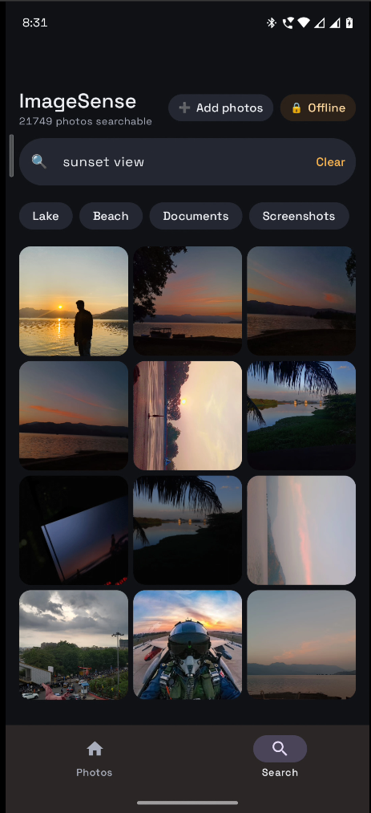
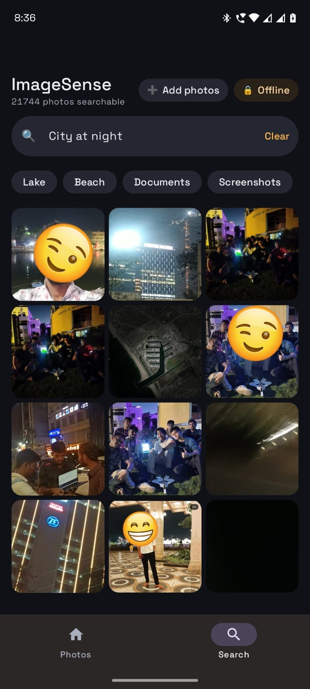
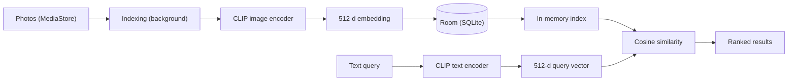
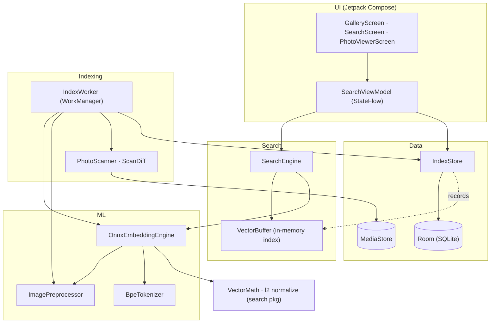

# ImageSense

**On-device semantic photo search for Android.** Find photos by describing what's in them, such as "a lake", "a parked car", or "a bank document", entirely offline. No cloud, no accounts, and no data ever leaves the phone.

ImageSense runs a quantized CLIP vision-language model directly on the device. Every photo is converted into an embedding once, during a background indexing pass, and every search is a vector similarity lookup against that local index. The app ships with **no `INTERNET` permission**, which is verifiable from the APK manifest, so privacy is enforced by the build rather than promised in a policy.

<p align="center">
  
  <br>
  <sub><code>“sunset view”</code></sub>
</p>

<p align="center">
  
  <br>
  <sub><code>“city at night”</code></sub>
</p>

<p align="center">
  <sub>Two natural-language queries over a library of roughly 21,000 photos, ranked entirely on-device.</sub>
</p>

---

## Why this project

Cloud photo search is convenient, but it requires uploading your entire library to a third party. ImageSense demonstrates that the same natural-language search experience can run fully on a phone, including the neural network inference, with strong accuracy and acceptable latency. It is a self-contained example of shipping real machine learning on a constrained device, covering quantization, model export, on-device tokenization, incremental indexing, and a Jetpack Compose UI in one codebase.

---

## Features

- **Natural-language search.** Query your gallery in plain English; results are ranked best-match first.
- **Find similar.** Pick any photo and surface visually related ones from your library.
- **Fully offline.** All inference and indexing run on-device; the app cannot reach the network.
- **Incremental indexing.** Only new or changed photos are processed, and runs resume safely if interrupted.
- **Resilient.** Un-decodable or unsupported files are skipped without aborting the index.
- **Modern Android UI.** Jetpack Compose, Material 3, a time-grouped gallery, a pinch-to-zoom viewer, share, and delete.
- **Privacy by construction.** No `INTERNET` permission, enforced by an automated manifest test.

---

## How it works



Images and text are projected into the same 512-dimensional embedding space by the two halves of a CLIP model. Because the vectors are L2-normalized, cosine similarity reduces to a dot product, so each query is a single pass over the in-memory index.

**Model.** CLIP ViT-B/32, exported to ONNX and **dynamically quantized to int8**. int8 was chosen over fp16 deliberately: true fp16 overflows during on-device inference (desktop runtimes mask this by silently upcasting), whereas int8 dynamic quantization keeps activations in fp32, which is numerically stable, smaller, and faster.

---

## Architecture

The app is organized into clear layers. The UI never talks to the model or the
database directly; it drives a view model, which composes a search layer over an
ML layer and a storage layer. Indexing runs as background work that feeds the
same storage the search layer reads from.



- The **ML layer** is the only code that touches ONNX Runtime; everything above
  it depends on the small `EmbeddingEngine` interface, which keeps inference
  swappable and testable with fakes.
- The **search layer** holds the embeddings in a flat in-memory buffer and scores
  every query with a single normalized dot-product pass.
- The **indexing layer** is decoupled from Android: its core logic is a pure
  function with injected collaborators, so it is unit-tested without a device.
- The **data layer** persists embeddings as little-endian float bytes in Room and
  rebuilds the in-memory buffer on launch.

A directory-level map is in [Project structure](#project-structure), and the
original design specs and implementation plans live under
[`docs/design`](docs/design) and [`docs/plans`](docs/plans).

---

## Accuracy and performance

Quantizing a model on-device is only useful if it stays faithful to the original. ImageSense treats that as a measured, regression-tested property rather than an assumption.

| Metric | Result |
|--------|--------|
| Embedding fidelity (int8 on-device vs. full-precision reference) | **cosine ≥ 0.89** |
| Parity test floor (build fails below this) | cosine 0.83 |
| Embedding dimension | 512 |
| Library size validated | ~21,000 photos on a single device |
| Search complexity per query | one linear pass over the in-memory index |

The fidelity number is produced by an instrumented parity test: the same inputs are embedded by the on-device int8 model and by the full-precision reference model, and the build fails if their cosine similarity drops below the floor. In practice the quantized model stays at **0.89 or above**, meaning the on-device embeddings are effectively interchangeable with the reference. The screenshots above show the qualitative result of this fidelity, with abstract queries such as "sunset view" and "city at night" returning correct matches across a large real-world library.

---

## Tech stack

| Layer | Choice |
|-------|--------|
| Language and UI | Kotlin, Jetpack Compose, Material 3 |
| ML runtime | ONNX Runtime for Android (`onnxruntime-android`) |
| Model | CLIP ViT-B/32, int8 dynamic-quantized (image and text encoders) |
| Tokenizer | Hand-ported CLIP BPE tokenizer (no Python at runtime) |
| Persistence | Room (SQLite) for embeddings, in-memory buffer for search |
| Background work | WorkManager (`CoroutineWorker`) |
| Images | Coil |
| Min / target SDK | 26 / 35 |

---

## Engineering highlights

A few decisions worth calling out for anyone reading the code:

- **Quantization-aware accuracy gate.** An instrumented parity test compares on-device int8 embeddings against full-precision reference fixtures and fails the build if cosine similarity drops below the bar. Accuracy is a regression-tested invariant, not a hope.
- **Cold-start optimization.** ONNX Runtime sessions are rebuilt on every process start. ImageSense caches the optimized model graph to disk, keyed by app version, so later launches memory-map a pre-optimized model instead of re-optimizing it. The text encoder is warmed up ahead of the first query.
- **Tokenizer parsing.** Parsing the 49k-entry CLIP vocabulary with a regular expression cost roughly 46 seconds at startup. A hand-written single-pass JSON scanner brought it down to a few milliseconds.
- **Resumable indexing.** Embeddings are committed per batch, so an interrupted run simply re-diffs against the store and continues. No checkpoint bookkeeping is required.
- **Testable core.** Indexing logic, the scan diff, vector math, the tokenizer, and search are pure functions with injected collaborators, covered by JVM unit tests. Only genuinely device-bound behavior lives behind instrumented tests.

---

## Getting started

The CLIP model assets are large and fully regenerable, so they are not committed
to git. You generate them once with the included Python tooling, then build the
app. The full, authoritative walkthrough (prerequisites, troubleshooting, and
release steps) lives in **[SETUP.md](SETUP.md)**; the short version is:

```bash
# 1. Generate the int8 model assets (one-time; see SETUP.md for the Python env)
python tools/export_model.py && python tools/quantize_int8.py

# 2. Build and install on a connected device
export ANDROID_HOME=$HOME/Android/Sdk
./gradlew :app:installDebug
```

**Prerequisites:** JDK 17, Android SDK platform 35, Python 3.11 (one-time, for
model export only), and a device or emulator on API 26 or higher.

### Tests

```bash
# JVM unit tests: tokenizer, vector math, store, scan diff, search, privacy
./gradlew :app:testDebugUnitTest

# On-device parity gate, the accuracy regression test (requires a device)
./gradlew :app:connectedDebugAndroidTest \
  -Pandroid.testInstrumentationRunnerArguments.class=com.nlphotos.EmbeddingParityTest
```

---

## Project structure

```
app/src/main/java/com/nlphotos/
  ml/      CLIP inference, image preprocessing, BPE tokenizer
  index/   Background indexer (WorkManager)
  scan/    MediaStore enumeration and scan diffing
  data/    Room store and embedding (de)serialization
  search/  In-memory vector buffer, search engine, vector math
  ui/      Compose screens (gallery, search, viewer) and ViewModel
tools/     Model export, int8 quantization, parity fixtures, release scripts
```

---

## Roadmap

- Upgrade to a stronger on-device backbone (MobileCLIP or SigLIP) for higher retrieval accuracy.
- Relevance thresholding so weak matches are filtered rather than padded.
- Complementary indexes: on-device OCR for text in images, and face clustering.
- Approximate nearest-neighbor search to scale to very large libraries.
- Auto-generated albums via embedding clustering.

---

## Contributing

Issues and pull requests are welcome. A good first step is to read
[SETUP.md](SETUP.md), get the app building and the unit tests passing locally,
then open an issue describing the change before sending a large PR. Please keep
the test suite green; the on-device parity test in particular guards the
accuracy guarantee described above.

---

## License

Released under the [MIT License](LICENSE). You are free to use, modify, and
distribute this software, including for commercial purposes, provided the
license and copyright notice are retained.
